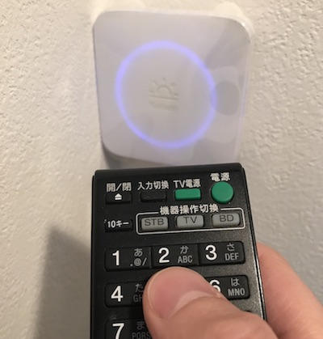

# homebridge-nature-remo

[](https://badge.fury.io/js/homebridge-nature-remo)
[](LICENSE)

Nature Remo plugin for homebridge: https://github.com/nfarina/homebridge

## feature

NatureRemoをSiriとHomekit(iOSのHomeアプリ)でコントロールするためのhomebridgeプラグインです。

このプラグインは以下の特徴があります。

* １アクセサリ操作でNatureRemoに複数コマンドを送ることができる
* コマンドごとにDelayを個別に指定できる
* 複数アクセサリ操作を並列で処理できる

例えば以下のユースケースの場合に便利です。

* シーン(例えばただいま)に、\[テレビをON\]\[Blu-rayをON\]\[エアコンをON\]など複数のアクセサリ操作を登録
* テレビをONにする際に、\[電源ボタン\]→5秒Delay→\[ホームボタン\]など、TVの起動を待ってから違うボタン実行するなど、アクセサリごとに複数コマンドを実行

Homebridgeの仕様？で、アクセサリ操作は同期処理されるため、上記のようなシーンを実行する場合にSiriがタイムアウトしてしまいます。  
(\[テレビをON\]のすべてのコマンドが終了した後に\[Blu-rayをON\]のコマンドが開始されるため、複数コマンドを実行する場合にかなり時間がかかる)

__ ただいまシーンの例 __

|   テレビをON   |  Blu-rayをON |                      エアコンをON                       |
|----------------|--------------|---------------------------------------------------------|
| 電源ボタン     |              |                                                         |
| ↓5秒Delay      |              |                                                         |
| 入力切替ボタン |              |                                                         |
| ↓3秒Delay      |              |                                                         |
| 下ボタン       |              |                                                         |
| ↓1秒Delay      |              |                                                         |
| 下ボタン       |              |                                                         |
| ↓1秒Delay      |              |                                                         |
| 決定ボタン     |              |                                                         |
|                | ↓1秒interval |                                                         |
|                | 電源ボタン   |                                                         |
|                | ↓3秒Delay    |                                                         |
|                | 1ボタン      |                                                         |
|                |              | ↓1秒interval                                            |
|                |              | 運転入ボタン                                            |
|                |              | ↓2秒Delay                                               |
|                |              | 運転入ボタン<br>(1度で電源オンにならない場合があるので予備) |

17秒以上かかる


↑ タイムアウトするSiri

そのためコマンドを非同期に実行し、アクセサリ操作の結果をすぐさま返却することでタイムアウトを回避しています。  
(ただし、SiriやHomekitにエラーを通知することができないので、エラーが発生した場合にオンオフの不整合が発生する可能性があります)

また、コマンドの実行タイミングを制御することで、コマンドのDelay中に、他アクセサリ操作のコマンドを実行することができるため、シーン全体の実行時間を短縮しています。


__ 非同期で処理した場合 __

|   テレビをON   |  Blu-rayをON |                        エアコンをON                         |
|----------------|--------------|-------------------------------------------------------------|
| 電源ボタン     |              |                                                             |
| ↓5秒Delay      | ↓1秒interval |                                                             |
| ↓              | 電源ボタン   |                                                             |
| ↓              | ↓3秒Delay    | ↓1秒interval                                                |
| ↓              | ↓            | 運転入ボタン                                                |
| 入力切替ボタン | ↓            | ↓2秒Delay                                                   |
| ↓3秒Delay      | 1ボタン      | ↓                                                            |
| ↓               |              | 運転入ボタン<br>(1度で電源オンにならない場合があるので予備) |
| ↓               |              |                                                             |
| 下ボタン       |              |                                                             |
| ↓1秒Delay      |              |                                                             |
| 下ボタン       |              |                                                             |
| ↓1秒Delay      |              |                                                             |
| 決定ボタン     |              |                                                             |

10秒くらいで終わる(はず)


↑ 表示上は一瞬で終わる

## Installation

```shell
npm install homebridge-nature-remo -g
```

## Configuration

### 1. Get Nature-Remo Address & Hostname

```shell
$ dns-sd -B _remo._tcp

dns-sd -B _remo._tcp
Browsing for _remo._tcp
DATE: ---Mon 26 Feb 2018---
23:17:46.880  ...STARTING...
Timestamp     A/R    Flags  if Domain               Service Type         Instance Name
23:17:47.087  Add        2   4 local.               _remo._tcp.          Remo-XXXX

$ dns-sd -G v4 Remo-XXXX.local

DATE: ---Mon 26 Feb 2018---
23:21:20.194  ...STARTING...
Timestamp     A/R Flags if Hostname                               Address                                      TTL
23:21:20.196  Add     2  4 Remo-XXXX.local.                     192.168.X.X                                  120
```

* Address → 192.168.X.X
* Hostname → Remo-XXXX.local


### 2. Press the button on the remote-control towards Nature-Remo And make sure glows blue



### 3. Get Nature-Remo IRSignal

```shell
$ curl -i "http://Remo-XXXX.local/messages" -H "X-Requested-With: curl"

HTTP/1.0 200 OK
Server: Remo/1.0.62-gabbf5bd
Content-Type: application/json

{"format":"us","freq":39,"data":[2360,634,1145,651,561,....]} // ← IRSignal
```


### 3. Create the config.json file
```shell
$ vim ~/.homebridge/config.json
```

```js
{
  "bridge": {
    "name": "Homebridge",
    "username": "CC:22:3D:E3:CE:30",
    "port": 51826,
    "pin": "031-45-154"
  },
  "description": "Nature Remo Control",
  "accessories": [{
    "accessory": "remo",
    "name": "Blu-ray",
    "host": "192.168.X.X",
    "timeout": 2000,
    "interval": 100,
    "retryInterval": 500,
    "retry": 4,
    "command": {
      "power": {
        "format": "us",
        "freq": 39,
        "data": [2360, 634, 1145, 651, 561, ....]
      },
      "home": {
        "format": "us",
        "freq": 39,
        "data": [2374, 635, 560, 638, 1143, ....]
      },
      "back": {
        "format": "us",
        "freq": 39,
        "data": [2338, 652, 1162, 636, 1147, ....]
      }
    },
    "on": ["home", { "delay": 1000, "command": "back" }],
    "off": ["home", { "command": "power" }]
  }]
}
```
Note: [config.json sample](./config.sample.json)


## Config Format

```js
{
  "accessory": "remo",
  "name": "(DeviceName)",
  "host": "(Address or Hostname)",
  "timeout": (option millisec),
  "interval": (option millisec),
  "retryInterval": (option millisec),
  "retry": (option number),
  "command": {
    "CommandName1": (Nature-Remo IRSignal),
    "CommandName2": (Nature-Remo IRSignal),
    "CommandName3": (Nature-Remo IRSignal),
    ...
  },
  // CommandName1 → commandName2 → commandName3
  "on": [
    "CommandName1", "CommandName3", "CommandName3"
  ],
  // CommandName1 → delay → commandName2 → commandName3
  "off": [
    "CommandName1",
    {
      "delay": (option millisec),
      "command": "CommandName2"
    },
    {
      "command": "CommandName3"
    }
  ]
}
```
